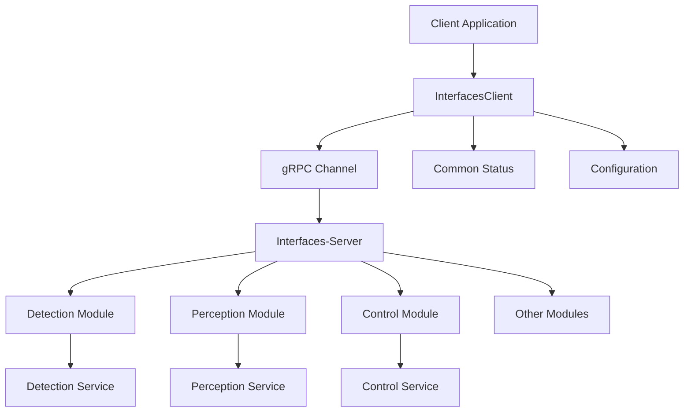

# Humanoid Robot Client SDK 设计文档

**版本**: 1.0  
**日期**: 2025年8月1日  
**作者**: Humanoid Robot, Inc.  

## 目录

1. [概述](#1-概述)
2. [架构设计](#2-架构设计)
3. [模块设计](#3-模块设计)
4. [API设计](#4-api设计)
5. [通信协议](#5-通信协议)
6. [错误处理](#6-错误处理)
7. [性能考虑](#7-性能考虑)
8. [扩展性设计](#8-扩展性设计)
9. [部署指南](#9-部署指南)
10. [示例代码](#10-示例代码)

---

## 1. 概述

### 1.1 项目目标

Humanoid Robot Client SDK 是一个基于 gRPC 的 C++ 客户端库，专为人形机器人系统设计。它通过与Interfaces-Server通信，为客户端应用提供访问各种后端业务模块（Detection、Perception、Control等）的统一接口。

### 1.2 架构概述

Client-SDK采用API Gateway架构模式：
- **Client-SDK** ←→ **Interfaces-Server** ←→ **Backend Modules**
- 客户端只需连接Interfaces-Server一个端点
- Interfaces-Server负责请求路由和协议转换
- 后端模块专注于业务逻辑实现

### 1.3 核心特性

- **统一接口**: 通过InterfacesClient访问所有后端服务，简化客户端开发
- **API Gateway**: Interfaces-Server作为服务网关，提供统一入口和协议转换
- **多协议支持**: 基于 gRPC + Protocol Buffers 的高性能通信
- **异步/同步**: 同时支持同步和异步调用模式
- **流式通信**: 支持服务器端流式响应和实时事件订阅
- **类型安全**: 强类型 Protocol Buffers 消息保证接口安全
- **错误处理**: 统一的错误处理和状态管理机制
- **高性能**: 连接池、消息压缩、超时控制等优化
- **易扩展**: 模块化设计，支持新服务的快速集成

### 1.4 适用场景

- **机器人控制系统**: 通过Interfaces-Server远程控制各个业务模块
- **数据采集分析**: 从Detection、Perception等模块获取处理结果
- **实时监控**: 订阅后端模块的状态更新和事件通知
- **系统集成**: 将多个业务模块的功能集成到统一的客户端应用
- **分布式部署**: 支持客户端与服务端的分离部署

---

## 2. 架构设计

### 2.1 整体架构

```
┌─────────────────────────────────────────────────────────────┐
│                    Client Application                       │
├─────────────────────────────────────────────────────────────┤
│                    Client-SDK Layer                         │
│                  ┌─────────────────┐                        │
│                  │ InterfacesClient│                        │
│                  │   (gRPC Client) │                        │
│                  └─────────────────┘                        │
├─────────────────────────────────────────────────────────────┤
│                    Common Components                        │
│  ┌─────────────┐  ┌─────────────┐  ┌─────────────┐         │
│  │   Status    │  │ Error Code  │  │  Utilities  │         │
│  │  Management │  │   System    │  │   & Helpers │         │
│  └─────────────┘  └─────────────┘  └─────────────┘         │
├─────────────────────────────────────────────────────────────┤
│                    gRPC Framework                           │
│  ┌─────────────┐  ┌─────────────┐  ┌─────────────┐         │
│  │   Channel   │  │ Protobuf    │  │ Connection  │         │
│  │ Management  │  │ Serialization│  │ Management  │         │
│  └─────────────┘  └─────────────┘  └─────────────┘         │
├─────────────────────────────────────────────────────────────┤
│                      Network Layer                          │
│             HTTP/2 + TLS (Optional)                         │
│                         │                                   │
│                     gRPC通信                                │
│                         │                                   │
└─────────────────────────┼───────────────────────────────────┘
                          │
┌─────────────────────────┼───────────────────────────────────┐
│                    Interfaces-Server                       │
│                (服务网关/API Gateway)                       │
│  ┌─────────────────────────────────────────────────────┐   │
│  │              InterfaceService                       │   │
│  │            (gRPC服务实现)                           │   │
│  └─────────────────────────────────────────────────────┘   │
├─────────────────────────────────────────────────────────────┤
│                     内部通信层                              │
│  ┌─────────────┐  ┌─────────────┐  ┌─────────────┐         │
│  │   Service   │  │   Message   │  │   RPC/IPC   │         │
│  │   Router    │  │   Broker    │  │  Framework  │         │
│  └─────────────┘  └─────────────┘  └─────────────┘         │
├─────────────────────────────────────────────────────────────┤
│                      业务模块层                             │
│  ┌─────────────┐  ┌─────────────┐  ┌─────────────┐         │
│  │ Detection   │  │ Perception  │  │  Control    │  ...    │
│  │   Module    │  │   Module    │  │   Module    │         │
│  └─────────────┘  └─────────────┘  └─────────────┘         │
└─────────────────────────────────────────────────────────────┘
```

### 2.2 分层设计

#### 2.2.1 应用层 (Client Application)
- 用户业务逻辑实现
- SDK API 调用
- 业务特定的错误处理

#### 2.2.2 SDK层 (Client-SDK Layer)
- **InterfacesClient**: 唯一的客户端实现，提供统一的API接口
- **接口抽象**: 封装gRPC通信细节，提供简洁易用的接口
- **会话管理**: 连接状态、认证、重连等

#### 2.2.3 公共组件层 (Common Components)
- **状态管理**: 统一的状态和错误处理
- **工具库**: 通用工具函数和帮助类
- **配置管理**: 连接参数、超时设置等

#### 2.2.4 通信层 (gRPC Framework)
- **gRPC框架**: 与Interfaces-Server的通信协议支持
- **Protocol Buffers**: 消息序列化和反序列化
- **传输层**: HTTP/2 网络传输

#### 2.2.5 服务端网关层 (Interfaces-Server)
- **服务路由**: 将客户端请求路由到对应的业务模块
- **协议转换**: gRPC与内部通信协议的转换
- **负载均衡**: 在多个业务模块实例间分发请求
- **统一认证**: 客户端认证和权限控制

#### 2.2.6 业务模块层 (Backend Modules)
- **Detection Module**: 目标检测和识别服务
- **Perception Module**: 环境感知和传感器融合
- **Control Module**: 机器人控制和运动规划
- **其他模块**: 根据业务需要扩展的功能模块

### 2.3 架构特点与优势

#### 2.3.1 API Gateway 模式
Client-SDK采用API Gateway架构模式，所有客户端请求通过Interfaces-Server统一入口：

- **单一入口**: 客户端只需连接一个服务端点
- **协议统一**: 使用统一的gRPC接口，简化客户端实现
- **服务发现**: 由Interfaces-Server负责定位和调用后端服务
- **版本管理**: 在网关层处理API版本兼容性

#### 2.3.2 模块间关系



#### 2.3.3 通信流程

1. **Client-SDK** 发起gRPC请求到 **Interfaces-Server**
2. **Interfaces-Server** 解析请求，确定目标业务模块
3. **Interfaces-Server** 通过内部通信（RPC/Message Queue等）调用业务模块
4. **业务模块** 处理请求并返回结果
5. **Interfaces-Server** 封装结果，通过gRPC返回给 **Client-SDK**

---

## 3. 模块设计

### 3.1 核心模块

### 3.1 核心模块

#### 3.1.1 InterfacesClient (接口客户端)

**职责**: 提供与Interfaces-Server通信的统一客户端接口

**主要功能**:
- **资源管理**: Create, Delete, Query - 管理机器人系统中的各种资源
- **消息传递**: Send - 向后端模块发送控制指令和数据
- **事件订阅**: Subscribe - 接收后端模块推送的实时事件和状态更新
- **批量操作**: BatchCreate - 提高操作效率的批量资源创建
- **健康检查**: HealthCheck - 监控Interfaces-Server和后端服务状态
- **会话管理**: Connect, Disconnect - 管理与服务端的连接生命周期

**设计特点**:
- PIMPL 设计模式隐藏gRPC实现细节
- 支持同步和异步调用模式
- 线程安全的异步操作
- 自动连接管理和错误恢复
- 统一的错误处理和状态反馈

**与后端模块的交互**:
通过Interfaces-Server作为代理，InterfacesClient可以间接访问所有后端业务模块：

- **Detection服务**: 通过Create/Send调用目标检测和识别功能
- **Perception服务**: 通过Query/Subscribe获取环境感知数据
- **Control服务**: 通过Send发送运动控制指令
- **其他服务**: 通过统一接口访问扩展的业务功能

```cpp
class InterfacesClient {
public:
    // 连接管理
    Status Connect(const std::string& server_address, int port);
    void Disconnect();
    bool IsConnected() const;
    
    // 同步操作
    Status Create(const CreateRequest& req, CreateResponse& resp, int64_t timeout_ms = 5000);
    Status Send(const SendRequest& req, SendResponse& resp, int64_t timeout_ms = 5000);
    Status Query(const QueryRequest& req, QueryResponse& resp, int64_t timeout_ms = 5000);
    
    // 异步操作
    AsyncResult<CreateResponse> CreateAsync(const CreateRequest& req, int64_t timeout_ms = 5000);
    void CreateAsync(const CreateRequest& req, AsyncCallback<CreateResponse> callback, int64_t timeout_ms = 5000);
    
    // 流式操作
    Status Subscribe(const SubscribeRequest& req, 
                    std::function<void(const SubscribeResponse&)> callback, 
                    int64_t timeout_ms = 0);
    
private:
    class Impl;
    std::unique_ptr<Impl> pImpl_;
};
```

#### 3.1.2 Status Management (状态管理)

**职责**: 统一的错误处理和状态管理

**设计特点**:
- 基于 std::error_code 的错误系统
- [[nodiscard]] 属性防止忽略错误
- 错误链式传播和上下文保留
- 与 gRPC Status 的自动转换

```cpp
class Status {
public:
    Status() = default;
    Status(const std::error_code& code, std::string message = "");
    
    operator bool() const;  // 隐式转换检查成功
    std::error_code code() const;
    const std::string& message() const;
    
    // 错误检查
    template<typename ENUM>
    bool Is() const;
    
    // 错误传播
    Status Chain(std::string message) const;
    Status Chain(std::error_code code, std::string message) const;
    
    std::string DebugString() const;
    void IgnoreError() const;
};
```

#### 3.1.3 Connection Management (连接管理)

**职责**: gRPC 连接的创建、维护和生命周期管理

**功能特性**:
- 连接池管理
- 自动重连机制
- 连接状态监控
- 超时和重试策略

### 3.2 服务端集成模块

由于Client-SDK只与Interfaces-Server通信，因此不再包含独立的Detection Client、Perception Client等模块。所有后端服务的访问都通过InterfacesClient的统一接口实现：

#### 3.2.1 Detection服务集成
- **目标检测**: 通过Create请求创建检测任务
- **图像分析**: 通过Send发送图像数据进行分析
- **结果获取**: 通过Query查询检测结果
- **实时检测**: 通过Subscribe订阅实时检测事件

#### 3.2.2 Perception服务集成
- **环境感知**: 通过Query获取环境感知数据
- **传感器融合**: 通过Send发送多传感器数据
- **空间映射**: 通过Create创建和管理空间地图
- **定位服务**: 通过Subscribe订阅位置更新事件

#### 3.2.3 Control服务集成
- **运动控制**: 通过Send发送运动控制指令
- **轨迹规划**: 通过Create创建运动轨迹
- **状态监控**: 通过Query查询机器人状态
- **紧急停止**: 通过特殊的Send指令实现紧急停止

#### 3.2.4 服务路由机制

Interfaces-Server通过请求中的参数来确定目标服务：

```cpp
// 例：检测服务调用
interfaces::CreateRequest request;
auto* req_data = request.mutable_requestdata();
auto* items = req_data->mutable_keyvaluelist();

// 指定目标服务
base_types::Variant service_variant;
service_variant.set_type(base_types::Variant::KStringValue);
service_variant.set_stringvalue("detection");
(*items)["target_service"] = service_variant;

// 指定操作类型
base_types::Variant operation_variant;
operation_variant.set_type(base_types::Variant::KStringValue);
operation_variant.set_stringvalue("object_detection");
(*items)["operation"] = operation_variant;
```

---

## 4. API设计

### 4.1 设计原则

#### 4.1.1 一致性原则
- 所有客户端遵循相同的接口模式
- 统一的命名约定和参数顺序
- 一致的错误处理和返回值

#### 4.1.2 易用性原则
- 简单操作提供默认参数
- 复杂操作提供构建器模式
- 清晰的文档和示例代码

#### 4.1.3 性能原则
- 异步优先的设计思想
- 最小化内存拷贝和分配
- 支持批量操作减少网络往返

#### 4.1.4 安全性原则
- 类型安全的接口设计
- 输入验证和边界检查
- 资源自动管理和清理

### 4.2 接口模式

#### 4.2.1 同步模式

```cpp
// 模式: Status Operation(const Request& req, Response& resp, int64_t timeout_ms)
Status status = client.Create(createRequest, createResponse, 5000);
if (status) {
    // 处理成功结果
    std::cout << "Created resource: " << createResponse.resourceid() << std::endl;
} else {
    // 处理错误
    std::cerr << "Create failed: " << status.message() << std::endl;
}
```

#### 4.2.2 异步模式 (Future)

```cpp
// 模式: AsyncResult<Response> OperationAsync(const Request& req, int64_t timeout_ms)
auto future = client.CreateAsync(createRequest, 5000);
// 执行其他工作...
auto status = future.get();
```

#### 4.2.3 异步模式 (Callback)

```cpp
// 模式: void OperationAsync(const Request& req, AsyncCallback<Response> callback, int64_t timeout_ms)
client.CreateAsync(createRequest, 
    [](const Status& status, const CreateResponse& response) {
        if (status) {
            std::cout << "Async create succeeded: " << response.resourceid() << std::endl;
        } else {
            std::cerr << "Async create failed: " << status.message() << std::endl;
        }
    }, 5000);
```

#### 4.2.4 流式模式

```cpp
// 模式: Status Subscribe(const Request& req, std::function<void(const Response&)> callback, int64_t timeout_ms)
Status status = client.Subscribe(subscribeRequest,
    [](const SubscribeResponse& response) {
        std::cout << "Received event: " << response.message() << std::endl;
    }, 60000);
```

### 4.3 便捷函数

#### 4.3.1 工厂函数

```cpp
// 快速创建连接的客户端
Status CreateInterfacesClient(const std::string& server_address, int port, 
                             std::unique_ptr<InterfacesClient>& client);

Status CreateInterfacesClient(const std::string& target, 
                             std::unique_ptr<InterfacesClient>& client);
```

#### 4.3.2 构建器函数

```cpp
// 复杂请求的构建器
class CreateRequestBuilder {
public:
    CreateRequestBuilder& SetResourceType(const std::string& type);
    CreateRequestBuilder& AddData(const std::string& key, const Variant& value);
    CreateRequestBuilder& SetTimeout(int32_t timeout);
    CreateRequestBuilder& SetCorrelationId(const std::string& id);
    CreateRequest Build();
};
```

---

## 5. 通信协议

### 5.1 Protocol Buffers 消息设计

#### 5.1.1 基础类型系统

```protobuf
// 通用变体类型，支持多种数据类型
message Variant {
  Type type = 1;
  oneof value {
    bool boolValue = 2;
    int32 int32Value = 7;
    int64 int64Value = 9;
    string stringValue = 15;
    Dictionary dictValue = 18;
    // ... 更多类型
  }
}

// 键值对字典
message Dictionary {
  map<string, Variant> keyValueList = 1;
}
```

#### 5.1.2 通用参数结构

```protobuf
// 通用参数结构
message Params {
  Dictionary parameters = 1;    // 通用参数字典
  int32 timeout = 2;           // 超时时间（秒）
  string correlationId = 3;    // 关联ID
}

// 通用错误信息
message ErrorInfo {
  string code = 1;        // 错误代码
  string message = 2;     // 错误消息
  string details = 3;     // 详细信息
  int64 timestamp = 4;    // 错误发生时间戳
}
```

#### 5.1.3 状态枚举

```protobuf
// 通用结果状态
enum ResultStatus {
  STATUS_UNKNOWN = 0;
  STATUS_SUCCESS = 1;
  STATUS_FAILED = 2;
  STATUS_TIMEOUT = 3;
  STATUS_CANCELLED = 4;
  STATUS_PENDING = 5;
}
```

### 5.2 gRPC 服务定义

#### 5.2.1 InterfaceService

```protobuf
service InterfaceService {
  // 基础 CRUD 操作
  rpc Create(CreateRequest) returns (CreateResponse);
  rpc Send(SendRequest) returns (SendResponse);
  rpc Delete(DeleteRequest) returns (DeleteResponse);
  rpc Query(QueryRequest) returns (QueryResponse);
  
  // 高级操作
  rpc Subscribe(SubscribeRequest) returns (stream SubscribeResponse);
  rpc Unsubscribe(UnsubscribeRequest) returns (UnsubscribeResponse);
  rpc BatchCreate(BatchCreateRequest) returns (BatchCreateResponse);
  rpc HealthCheck(HealthCheckRequest) returns (HealthCheckResponse);
}
```

#### 5.2.2 请求/响应消息

```protobuf
// 创建请求
message CreateRequest {
  Dictionary requestData = 1;  // 创建请求数据
  Params params = 2;          // 附加参数
}

// 创建响应
message CreateResponse {
  ResultStatus status = 1;                // 操作状态
  string message = 2;                     // 响应消息
  Dictionary responseData = 3;            // 创建结果数据
  ErrorInfo error = 4;                    // 错误信息（如果有）
  string resourceId = 5;                  // 创建的资源ID
}
```

### 5.3 连接配置

#### 5.3.1 gRPC 通道配置

```cpp
grpc::ChannelArguments args;
args.SetMaxReceiveMessageSize(100 * 1024 * 1024);  // 100MB
args.SetMaxSendMessageSize(100 * 1024 * 1024);     // 100MB
args.SetKeepAliveTime(30 * 1000);                  // 30秒
args.SetKeepAliveTimeout(5 * 1000);                // 5秒
args.SetKeepAlivePermitWithoutCalls(true);
args.SetHttp2InitialSequenceNumber(1);
```

#### 5.3.2 SSL/TLS 配置

```cpp
// 生产环境使用 SSL
auto ssl_creds = grpc::SslCredentials(grpc::SslCredentialsOptions());
auto channel = grpc::CreateChannel(target, ssl_creds);

// 开发环境使用不安全连接
auto insecure_creds = grpc::InsecureChannelCredentials();
auto channel = grpc::CreateChannel(target, insecure_creds);
```

---

## 6. 错误处理

### 6.1 错误分类

#### 6.1.1 连接错误
- `std::errc::connection_refused` - 连接被拒绝
- `std::errc::host_unreachable` - 主机不可达
- `std::errc::not_connected` - 客户端未连接
- `std::errc::network_unreachable` - 网络不可达

#### 6.1.2 操作错误
- `std::errc::timed_out` - 操作超时
- `std::errc::operation_canceled` - 操作被取消
- `std::errc::invalid_argument` - 无效参数
- `std::errc::permission_denied` - 权限被拒绝

#### 6.1.3 业务错误
- `std::errc::no_such_file_or_directory` - 资源不存在
- `std::errc::file_exists` - 资源已存在
- `std::errc::function_not_supported` - 功能不支持
- `std::errc::io_error` - 通用IO错误

### 6.2 错误处理策略

#### 6.2.1 自动重试机制

```cpp
class RetryPolicy {
public:
    RetryPolicy(int max_attempts = 3, 
                std::chrono::milliseconds initial_delay = std::chrono::milliseconds(100),
                double backoff_multiplier = 2.0);
    
    bool ShouldRetry(const Status& status, int attempt_count) const;
    std::chrono::milliseconds GetDelay(int attempt_count) const;
};
```

#### 6.2.2 断路器模式

```cpp
class CircuitBreaker {
public:
    enum State { CLOSED, OPEN, HALF_OPEN };
    
    bool AllowRequest();
    void RecordSuccess();
    void RecordFailure();
    State GetState() const;
};
```

#### 6.2.3 错误传播

```cpp
// 错误上下文保留
Status ProcessResource(const std::string& resource_id) {
    auto status = client.Query(query_req, query_resp);
    if (!status) {
        return status.Chain("Failed to query resource: " + resource_id);
    }
    
    auto create_status = client.Create(create_req, create_resp);
    if (!create_status) {
        return create_status.Chain(std::errc::io_error, 
                                  "Failed to create derived resource");
    }
    
    return Status(); // 成功
}
```

### 6.3 日志和诊断

#### 6.3.1 结构化日志

```cpp
class Logger {
public:
    void LogError(const Status& status, const std::string& operation,
                  const std::map<std::string, std::string>& context = {});
    void LogWarning(const std::string& message, 
                   const std::map<std::string, std::string>& context = {});
    void LogInfo(const std::string& message,
                const std::map<std::string, std::string>& context = {});
};
```

#### 6.3.2 性能监控

```cpp
class MetricsCollector {
public:
    void RecordLatency(const std::string& operation, std::chrono::milliseconds latency);
    void RecordError(const std::string& operation, const Status& status);
    void RecordThroughput(const std::string& operation, int64_t bytes);
};
```

---

## 7. 性能考虑

### 7.1 连接管理优化

#### 7.1.1 连接池

```cpp
class ConnectionPool {
public:
    std::shared_ptr<grpc::Channel> GetChannel(const std::string& target);
    void ReturnChannel(const std::string& target, std::shared_ptr<grpc::Channel> channel);
    void CleanupIdleConnections();
    
private:
    std::unordered_map<std::string, std::vector<std::shared_ptr<grpc::Channel>>> pools_;
    std::mutex mutex_;
};
```

#### 7.1.2 Keep-Alive 配置

```cpp
// 保持连接活跃
grpc::ChannelArguments args;
args.SetInt(GRPC_ARG_KEEPALIVE_TIME_MS, 30000);           // 30秒
args.SetInt(GRPC_ARG_KEEPALIVE_TIMEOUT_MS, 5000);         // 5秒超时
args.SetInt(GRPC_ARG_KEEPALIVE_PERMIT_WITHOUT_CALLS, 1);  // 允许无调用时发送
args.SetInt(GRPC_ARG_HTTP2_MAX_PINGS_WITHOUT_DATA, 0);    // 无限制
```

### 7.2 消息优化

#### 7.2.1 消息压缩

```cpp
// 启用消息压缩
grpc::ClientContext context;
context.set_compression_algorithm(GRPC_COMPRESS_GZIP);
```

#### 7.2.2 批量操作

```cpp
// 批量创建减少网络往返
BatchCreateRequest batch_request;
for (const auto& item : items) {
    *batch_request.add_requestdatalist() = item;
}
batch_request.set_atomicoperation(true);

BatchCreateResponse batch_response;
auto status = client.BatchCreate(batch_request, batch_response, 30000);
```

### 7.3 内存管理

#### 7.3.1 对象池

```cpp
template<typename T>
class ObjectPool {
public:
    std::unique_ptr<T> Acquire();
    void Release(std::unique_ptr<T> obj);
    
private:
    std::vector<std::unique_ptr<T>> available_;
    std::mutex mutex_;
};
```

#### 7.3.2 零拷贝优化

```cpp
// 使用移动语义避免拷贝
Status CreateResource(CreateRequest&& request) {
    return client_.Create(std::move(request), response_, timeout_);
}
```

### 7.4 并发控制

#### 7.4.1 线程池

```cpp
class ThreadPool {
public:
    ThreadPool(size_t num_threads);
    ~ThreadPool();
    
    template<typename F>
    auto Submit(F&& f) -> std::future<decltype(f())>;
    
private:
    std::vector<std::thread> workers_;
    std::queue<std::function<void()>> tasks_;
    std::mutex mutex_;
    std::condition_variable condition_;
    bool stop_;
};
```

#### 7.4.2 异步执行

```cpp
// 异步执行避免阻塞
void InterfacesClient::CreateAsync(const CreateRequest& request,
                                  AsyncCallback<CreateResponse> callback,
                                  int64_t timeout_ms) {
    thread_pool_.Submit([this, request, callback, timeout_ms]() {
        CreateResponse response;
        auto status = Create(request, response, timeout_ms);
        callback(status, response);
    });
}
```

---

## 8. 扩展性设计

### 8.1 插件架构

#### 8.1.1 客户端工厂

```cpp
class ClientFactory {
public:
    template<typename ClientType>
    static std::unique_ptr<ClientType> CreateClient(const ClientConfig& config);
    
    static void RegisterClientType(const std::string& type_name,
                                  std::function<std::unique_ptr<BaseClient>(const ClientConfig&)> factory);
    
private:
    static std::unordered_map<std::string, 
                             std::function<std::unique_ptr<BaseClient>(const ClientConfig&)>> factories_;
};
```

#### 8.1.2 基础客户端接口

```cpp
class BaseClient {
public:
    virtual ~BaseClient() = default;
    virtual Status Connect(const std::string& target) = 0;
    virtual void Disconnect() = 0;
    virtual bool IsConnected() const = 0;
    virtual grpc_connectivity_state GetChannelState(bool try_to_connect = false) = 0;
};
```

### 8.2 配置系统

#### 8.2.1 配置管理

```cpp
class Configuration {
public:
    void LoadFromFile(const std::string& config_file);
    void LoadFromEnvironment();
    void LoadFromCommandLine(int argc, char* argv[]);
    
    template<typename T>
    T Get(const std::string& key, const T& default_value = T{}) const;
    
    void Set(const std::string& key, const std::string& value);
    
private:
    std::unordered_map<std::string, std::string> config_;
};
```

#### 8.2.2 配置文件格式

```yaml
# client_config.yaml
server:
  address: "localhost"
  port: 50051
  use_ssl: false

connection:
  timeout_ms: 5000
  keep_alive_time_ms: 30000
  keep_alive_timeout_ms: 5000
  max_message_size: 104857600  # 100MB

retry:
  max_attempts: 3
  initial_delay_ms: 100
  backoff_multiplier: 2.0

logging:
  level: "INFO"
  file: "client.log"
  max_size_mb: 100

metrics:
  enabled: true
  endpoint: "http://localhost:9090/metrics"
```

### 8.3 中间件系统

#### 8.3.1 拦截器接口

```cpp
class ClientInterceptor {
public:
    virtual ~ClientInterceptor() = default;
    
    virtual Status PreCall(const std::string& method_name,
                          grpc::ClientContext& context) = 0;
    
    virtual Status PostCall(const std::string& method_name,
                           const grpc::Status& status) = 0;
};
```

#### 8.3.2 中间件注册

```cpp
class MiddlewareManager {
public:
    void AddInterceptor(std::unique_ptr<ClientInterceptor> interceptor);
    void RemoveInterceptor(const std::string& name);
    
    Status ExecutePreCall(const std::string& method_name, grpc::ClientContext& context);
    Status ExecutePostCall(const std::string& method_name, const grpc::Status& status);
    
private:
    std::vector<std::unique_ptr<ClientInterceptor>> interceptors_;
};
```

---

## 9. 部署指南

### 9.1 构建系统

#### 9.1.1 CMake 配置

```cmake
# CMakeLists.txt
cmake_minimum_required(VERSION 3.8)
project(HumanoidRobotClientSDK)

# 设置 C++ 标准
set(CMAKE_CXX_STANDARD 17)
set(CMAKE_CXX_STANDARD_REQUIRED ON)

# 查找依赖
find_package(PkgConfig REQUIRED)
find_package(Protobuf REQUIRED)
find_package(gRPC REQUIRED)

# 设置输出目录
set(CMAKE_RUNTIME_OUTPUT_DIRECTORY ${CMAKE_BINARY_DIR}/bin)
set(CMAKE_LIBRARY_OUTPUT_DIRECTORY ${CMAKE_BINARY_DIR}/lib)

# 添加子目录
add_subdirectory(source)
add_subdirectory(example)

# 安装配置
install(DIRECTORY include/ DESTINATION include)
install(TARGETS robot_client DESTINATION lib)
```

#### 9.1.2 vcpkg 集成

```json
{
  "name": "humanoid-robot-client-sdk",
  "version": "1.0.0",
  "dependencies": [
    "grpc",
    "protobuf",
    "gtest",
    "benchmark"
  ]
}
```

### 9.2 依赖管理

#### 9.2.1 系统依赖

```bash
# Ubuntu/Debian
sudo apt-get update
sudo apt-get install -y \
    build-essential \
    cmake \
    git \
    pkg-config \
    libssl-dev \
    libgrpc++-dev \
    libprotobuf-dev \
    protobuf-compiler-grpc

# CentOS/RHEL
sudo yum install -y \
    gcc-c++ \
    cmake \
    git \
    pkgconfig \
    openssl-devel \
    grpc-devel \
    protobuf-devel
```

#### 9.2.2 编译步骤

```bash
# 克隆代码
git clone https://github.com/your-org/humanoid-robot-client-sdk.git
cd humanoid-robot-client-sdk

# 创建构建目录
mkdir build && cd build

# 配置构建
cmake .. -DCMAKE_BUILD_TYPE=Release

# 编译
make -j$(nproc)

# 安装
sudo make install
```

### 9.3 打包分发

#### 9.3.1 动态库打包

```bash
# 创建发布包
mkdir -p release/lib release/include release/examples
cp build/lib/*.so release/lib/
cp -r include/* release/include/
cp build/bin/interfaces_client_example release/examples/

# 创建 tar 包
tar czf humanoid-robot-client-sdk-1.0.0.tar.gz release/
```

#### 9.3.2 Docker 镜像

```dockerfile
FROM ubuntu:20.04

# 安装运行时依赖
RUN apt-get update && apt-get install -y \
    libgrpc++1 \
    libprotobuf23 \
    libssl1.1 \
    && rm -rf /var/lib/apt/lists/*

# 复制库文件
COPY release/lib/* /usr/local/lib/
COPY release/include/* /usr/local/include/

# 更新动态库缓存
RUN ldconfig

# 设置工作目录
WORKDIR /app

# 运行示例
CMD ["./interfaces_client_example"]
```

---

## 10. 示例代码

### 10.1 基础使用示例

#### 10.1.1 连接Interfaces-Server

```cpp
#include "robot/client/interfaces_client.h"

using namespace humanoid_robot::robot;

int main() {
    // 创建客户端并连接到Interfaces-Server
    std::unique_ptr<InterfacesClient> client;
    auto status = CreateInterfacesClient("localhost", 50051, client);
    
    if (!status) {
        std::cerr << "Failed to connect to Interfaces-Server: " << status.message() << std::endl;
        return 1;
    }
    
    // 检查Interfaces-Server健康状态
    interfaces::HealthCheckRequest health_req;
    health_req.set_service("InterfaceService");
    
    interfaces::HealthCheckResponse health_resp;
    status = client->HealthCheck(health_req, health_resp, 3000);
    
    if (status) {
        std::cout << "Interfaces-Server is healthy: " << health_resp.message() << std::endl;
    } else {
        std::cerr << "Interfaces-Server health check failed: " << status.message() << std::endl;
    }
    
    return 0;
}
```

#### 10.1.2 调用Detection服务

```cpp
// 通过Interfaces-Server调用Detection模块进行目标检测
void CallDetectionService(InterfacesClient* client) {
    interfaces::CreateRequest request;
    
    // 构建请求数据
    auto* req_data = request.mutable_requestdata();
    auto* items = req_data->mutable_keyvaluelist();
    
    // 指定目标服务为detection
    base_types::Variant service_variant;
    service_variant.set_type(base_types::Variant::KStringValue);
    service_variant.set_stringvalue("detection");
    (*items)["target_service"] = service_variant;
    
    // 指定检测操作
    base_types::Variant operation_variant;
    operation_variant.set_type(base_types::Variant::KStringValue);
    operation_variant.set_stringvalue("object_detection");
    (*items)["operation"] = operation_variant;
    
    // 添加图像数据（base64编码或路径）
    base_types::Variant image_variant;
    image_variant.set_type(base_types::Variant::KStringValue);
    image_variant.set_stringvalue("/path/to/image.jpg");
    (*items)["image_path"] = image_variant;
    
    // 设置参数
    auto* params = request.mutable_params();
    params->set_timeout(30);
    params->set_correlationid("detection-" + GenerateId());
    
    interfaces::CreateResponse response;
    auto status = client->Create(request, response, 10000);
    
    if (status) {
        std::cout << "Detection task created: " << response.resourceid() << std::endl;
        // response.responsedata()中包含Detection模块返回的检测结果
        ProcessDetectionResults(response.responsedata());
    } else {
        std::cerr << "Detection request failed: " << status.message() << std::endl;
    }
}
```

#### 10.1.3 调用Perception服务

```cpp
// 通过Interfaces-Server查询Perception模块的环境感知数据
void QueryPerceptionData(InterfacesClient* client) {
    interfaces::QueryRequest request;
    request.set_queryid("perception-query-" + GenerateId());
    request.set_limit(100);
    
    // 设置查询条件
    auto* conditions = request.mutable_queryconditions();
    auto* items = conditions->mutable_keyvaluelist();
    
    // 指定目标服务为perception
    base_types::Variant service_variant;
    service_variant.set_type(base_types::Variant::KStringValue);
    service_variant.set_stringvalue("perception");
    (*items)["target_service"] = service_variant;
    
    // 查询环境地图数据
    base_types::Variant data_type_variant;
    data_type_variant.set_type(base_types::Variant::KStringValue);
    data_type_variant.set_stringvalue("environment_map");
    (*items)["data_type"] = data_type_variant;
    
    interfaces::QueryResponse response;
    auto status = client->Query(request, response, 5000);
    
    if (status) {
        std::cout << "Perception query returned " << response.totalcount() 
                  << " environment data items" << std::endl;
        
        for (const auto& result : response.results()) {
            ProcessPerceptionData(result);
        }
    } else {
        std::cerr << "Perception query failed: " << status.message() << std::endl;
    }
}
```

#### 10.1.4 调用Control服务

```cpp
// 通过Interfaces-Server发送运动控制指令
void SendControlCommand(InterfacesClient* client) {
    interfaces::SendRequest request;
    
    // 设置消息数据
    auto* message_data = request.mutable_messagedata();
    auto* items = message_data->mutable_keyvaluelist();
    
    // 指定目标服务为control
    base_types::Variant service_variant;
    service_variant.set_type(base_types::Variant::KStringValue);
    service_variant.set_stringvalue("control");
    (*items)["target_service"] = service_variant;
    
    // 指定控制指令类型
    base_types::Variant command_variant;
    command_variant.set_type(base_types::Variant::KStringValue);
    command_variant.set_stringvalue("move_forward");
    (*items)["command"] = command_variant;
    
    // 设置运动参数
    base_types::Variant speed_variant;
    speed_variant.set_type(base_types::Variant::KInt32Value);
    speed_variant.set_int32value(50); // 50% speed
    (*items)["speed"] = speed_variant;
    
    base_types::Variant distance_variant;
    distance_variant.set_type(base_types::Variant::KStringValue);
    distance_variant.set_stringvalue("1.0m");
    (*items)["distance"] = distance_variant;
    
    // 设置参数
    auto* params = request.mutable_params();
    params->set_timeout(10);
    params->set_correlationid("control-" + GenerateId());
    
    interfaces::SendResponse response;
    auto status = client->Send(request, response, 5000);
    
    if (status) {
        std::cout << "Control command sent successfully: " << response.message() << std::endl;
    } else {
        std::cerr << "Control command failed: " << status.message() << std::endl;
    }
}
```

### 10.2 实时事件订阅示例

#### 10.2.1 订阅多模块事件

```cpp
#include "robot/client/interfaces_client.h"
#include <iostream>
#include <thread>
#include <chrono>

using namespace humanoid_robot::robot;

class MultiServiceEventHandler {
public:
    MultiServiceEventHandler(std::unique_ptr<InterfacesClient> client) 
        : client_(std::move(client)) {}
    
    void StartEventSubscription() {
        interfaces::SubscribeRequest request;
        request.set_topicid("multi_service_events");
        
        // 设置订阅参数
        auto* params = request.mutable_params();
        params->set_timeout(0); // 无超时，持续订阅
        params->set_correlationid("multi-service-subscription");
        
        // 可以通过requestdata指定要订阅的服务类型
        auto* req_data = request.mutable_requestdata();
        auto* items = req_data->mutable_keyvaluelist();
        
        // 订阅多个服务的事件
        base_types::Variant services_variant;
        services_variant.set_type(base_types::Variant::KStringValue);
        services_variant.set_stringvalue("detection,perception,control");
        (*items)["subscribe_services"] = services_variant;
        
        client_->SubscribeWithErrorHandling(request,
            [this](const interfaces::SubscribeResponse& response) {
                HandleServiceEvent(response);
            },
            [this](const Status& status) {
                if (!status) {
                    std::cerr << "Event subscription error: " << status.message() << std::endl;
                    ScheduleReconnect();
                }
            }, 0);
    }
    
private:
    std::unique_ptr<InterfacesClient> client_;
    
    void HandleServiceEvent(const interfaces::SubscribeResponse& response) {
        std::cout << "Received event: " << response.message() << std::endl;
        
        // 解析事件数据，确定来源服务
        if (response.has_eventdata()) {
            auto& event_items = response.eventdata().keyvaluelist();
            
            auto service_it = event_items.find("source_service");
            if (service_it != event_items.end()) {
                std::string service = service_it->second.stringvalue();
                
                if (service == "detection") {
                    HandleDetectionEvent(response);
                } else if (service == "perception") {
                    HandlePerceptionEvent(response);
                } else if (service == "control") {
                    HandleControlEvent(response);
                }
            }
        }
    }
    
    void HandleDetectionEvent(const interfaces::SubscribeResponse& response) {
        std::cout << "Processing detection event..." << std::endl;
        // 处理Detection模块的事件
        // 例如：新的目标检测结果、检测任务完成等
    }
    
    void HandlePerceptionEvent(const interfaces::SubscribeResponse& response) {
        std::cout << "Processing perception event..." << std::endl;
        // 处理Perception模块的事件
        // 例如：环境变化、传感器数据更新等
    }
    
    void HandleControlEvent(const interfaces::SubscribeResponse& response) {
        std::cout << "Processing control event..." << std::endl;
        // 处理Control模块的事件
        // 例如：运动完成、状态变化等
    }
    
    void ScheduleReconnect() {
        std::thread([this]() {
            std::this_thread::sleep_for(std::chrono::seconds(5));
            StartEventSubscription();
        }).detach();
    }
};

int main() {
    // 连接到Interfaces-Server
    std::unique_ptr<InterfacesClient> client;
    auto status = CreateInterfacesClient("localhost", 50051, client);
    
    if (!status) {
        std::cerr << "Failed to connect to Interfaces-Server: " << status.message() << std::endl;
        return 1;
    }
    
    // 创建事件处理器并开始订阅
    MultiServiceEventHandler handler(std::move(client));
    handler.StartEventSubscription();
    
    // 保持程序运行
    std::cout << "Subscribing to multi-service events. Press Enter to exit..." << std::endl;
    std::cin.get();
    
    return 0;
}
```

### 10.3 完整的机器人控制示例

```cpp
#include "robot/client/interfaces_client.h"
#include <vector>
#include <thread>
#include <chrono>

using namespace humanoid_robot::robot;

class RobotController {
public:
    RobotController(std::unique_ptr<InterfacesClient> client)
        : client_(std::move(client)) {}
    
    // 机器人初始化序列
    void InitializeRobot() {
        std::cout << "Initializing robot systems..." << std::endl;
        
        // 1. 检查所有服务健康状态
        if (!CheckSystemHealth()) {
            std::cerr << "System health check failed, aborting initialization" << std::endl;
            return;
        }
        
        // 2. 初始化感知系统
        InitializePerceptionSystem();
        
        // 3. 初始化控制系统
        InitializeControlSystem();
        
        // 4. 启动检测系统
        InitializeDetectionSystem();
        
        // 5. 开始事件监控
        StartSystemMonitoring();
        
        std::cout << "Robot initialization completed!" << std::endl;
    }
    
    // 执行复杂任务：检测并接近目标
    void ExecuteNavigateToTarget() {
        std::cout << "Starting navigate-to-target task..." << std::endl;
        
        // 1. 启动目标检测
        std::string detection_task_id = StartTargetDetection();
        if (detection_task_id.empty()) {
            std::cerr << "Failed to start target detection" << std::endl;
            return;
        }
        
        // 2. 等待检测结果
        auto detection_result = WaitForDetectionResult(detection_task_id);
        if (!detection_result.has_value()) {
            std::cerr << "Target detection failed or timed out" << std::endl;
            return;
        }
        
        // 3. 根据检测结果规划路径
        auto path = PlanNavigationPath(detection_result.value());
        if (path.empty()) {
            std::cerr << "Failed to plan navigation path" << std::endl;
            return;
        }
        
        // 4. 执行导航
        ExecuteNavigation(path);
    }
    
private:
    std::unique_ptr<InterfacesClient> client_;
    
    bool CheckSystemHealth() {
        interfaces::HealthCheckRequest request;
        request.set_service("all_services");
        
        interfaces::HealthCheckResponse response;
        auto status = client_->HealthCheck(request, response, 5000);
        
        if (status && response.status() == interfaces::STATUS_SUCCESS) {
            std::cout << "All systems healthy: " << response.message() << std::endl;
            return true;
        } else {
            std::cerr << "System health check failed: " << status.message() << std::endl;
            return false;
        }
    }
    
    void InitializePerceptionSystem() {
        interfaces::CreateRequest request;
        auto* req_data = request.mutable_requestdata();
        auto* items = req_data->mutable_keyvaluelist();
        
        // 指定perception服务
        base_types::Variant service_variant;
        service_variant.set_type(base_types::Variant::KStringValue);
        service_variant.set_stringvalue("perception");
        (*items)["target_service"] = service_variant;
        
        // 初始化环境感知
        base_types::Variant operation_variant;
        operation_variant.set_type(base_types::Variant::KStringValue);
        operation_variant.set_stringvalue("initialize_environment_mapping");
        (*items)["operation"] = operation_variant;
        
        interfaces::CreateResponse response;
        auto status = client_->Create(request, response, 10000);
        
        if (status) {
            std::cout << "Perception system initialized: " << response.resourceid() << std::endl;
        } else {
            std::cerr << "Failed to initialize perception system: " << status.message() << std::endl;
        }
    }
    
    void InitializeControlSystem() {
        interfaces::SendRequest request;
        auto* msg_data = request.mutable_messagedata();
        auto* items = msg_data->mutable_keyvaluelist();
        
        // 指定control服务
        base_types::Variant service_variant;
        service_variant.set_type(base_types::Variant::KStringValue);
        service_variant.set_stringvalue("control");
        (*items)["target_service"] = service_variant;
        
        // 校准关节和执行器
        base_types::Variant command_variant;
        command_variant.set_type(base_types::Variant::KStringValue);
        command_variant.set_stringvalue("calibrate_joints");
        (*items)["command"] = command_variant;
        
        interfaces::SendResponse response;
        auto status = client_->Send(request, response, 15000);
        
        if (status) {
            std::cout << "Control system calibrated successfully" << std::endl;
        } else {
            std::cerr << "Control system calibration failed: " << status.message() << std::endl;
        }
    }
    
    void InitializeDetectionSystem() {
        interfaces::CreateRequest request;
        auto* req_data = request.mutable_requestdata();
        auto* items = req_data->mutable_keyvaluelist();
        
        // 指定detection服务
        base_types::Variant service_variant;
        service_variant.set_type(base_types::Variant::KStringValue);
        service_variant.set_stringvalue("detection");
        (*items)["target_service"] = service_variant;
        
        // 加载检测模型
        base_types::Variant operation_variant;
        operation_variant.set_type(base_types::Variant::KStringValue);
        operation_variant.set_stringvalue("load_detection_models");
        (*items)["operation"] = operation_variant;
        
        base_types::Variant models_variant;
        models_variant.set_type(base_types::Variant::KStringValue);
        models_variant.set_stringvalue("person,chair,table,door");
        (*items)["models"] = models_variant;
        
        interfaces::CreateResponse response;
        auto status = client_->Create(request, response, 20000);
        
        if (status) {
            std::cout << "Detection models loaded: " << response.resourceid() << std::endl;
        } else {
            std::cerr << "Failed to load detection models: " << status.message() << std::endl;
        }
    }
    
    void StartSystemMonitoring() {
        interfaces::SubscribeRequest request;
        request.set_topicid("system_status");
        
        auto* req_data = request.mutable_requestdata();
        auto* items = req_data->mutable_keyvaluelist();
        
        // 监控所有服务的状态
        base_types::Variant services_variant;
        services_variant.set_type(base_types::Variant::KStringValue);
        services_variant.set_stringvalue("detection,perception,control");
        (*items)["monitor_services"] = services_variant;
        
        client_->SubscribeWithErrorHandling(request,
            [this](const interfaces::SubscribeResponse& response) {
                std::cout << "System status update: " << response.message() << std::endl;
            },
            [this](const Status& status) {
                std::cerr << "System monitoring error: " << status.message() << std::endl;
            }, 0);
    }
    
    std::string StartTargetDetection() {
        interfaces::CreateRequest request;
        auto* req_data = request.mutable_requestdata();
        auto* items = req_data->mutable_keyvaluelist();
        
        // Detection服务
        base_types::Variant service_variant;
        service_variant.set_type(base_types::Variant::KStringValue);
        service_variant.set_stringvalue("detection");
        (*items)["target_service"] = service_variant;
        
        // 检测人员目标
        base_types::Variant operation_variant;
        operation_variant.set_type(base_types::Variant::KStringValue);
        operation_variant.set_stringvalue("detect_person");
        (*items)["operation"] = operation_variant;
        
        // 使用实时摄像头
        base_types::Variant source_variant;
        source_variant.set_type(base_types::Variant::KStringValue);
        source_variant.set_stringvalue("camera_front");
        (*items)["source"] = source_variant;
        
        interfaces::CreateResponse response;
        auto status = client_->Create(request, response, 5000);
        
        if (status) {
            return response.resourceid();
        } else {
            return "";
        }
    }
    
    std::optional<DetectionResult> WaitForDetectionResult(const std::string& task_id) {
        // 查询检测结果
        interfaces::QueryRequest request;
        request.set_queryid("detection-result-" + task_id);
        
        auto* conditions = request.mutable_queryconditions();
        auto* items = conditions->mutable_keyvaluelist();
        
        base_types::Variant task_variant;
        task_variant.set_type(base_types::Variant::KStringValue);
        task_variant.set_stringvalue(task_id);
        (*items)["task_id"] = task_variant;
        
        // 轮询结果，最多等待30秒
        for (int i = 0; i < 30; ++i) {
            interfaces::QueryResponse response;
            auto status = client_->Query(request, response, 2000);
            
            if (status && response.totalcount() > 0) {
                // 解析检测结果
                return ParseDetectionResult(response.results(0));
            }
            
            std::this_thread::sleep_for(std::chrono::seconds(1));
        }
        
        return std::nullopt;
    }
    
    std::vector<NavigationWaypoint> PlanNavigationPath(const DetectionResult& target) {
        interfaces::CreateRequest request;
        auto* req_data = request.mutable_requestdata();
        auto* items = req_data->mutable_keyvaluelist();
        
        // Perception服务进行路径规划
        base_types::Variant service_variant;
        service_variant.set_type(base_types::Variant::KStringValue);
        service_variant.set_stringvalue("perception");
        (*items)["target_service"] = service_variant;
        
        base_types::Variant operation_variant;
        operation_variant.set_type(base_types::Variant::KStringValue);
        operation_variant.set_stringvalue("plan_navigation_path");
        (*items)["operation"] = operation_variant;
        
        // 设置目标位置
        base_types::Variant target_x_variant;
        target_x_variant.set_type(base_types::Variant::KStringValue);
        target_x_variant.set_stringvalue(std::to_string(target.x));
        (*items)["target_x"] = target_x_variant;
        
        base_types::Variant target_y_variant;
        target_y_variant.set_type(base_types::Variant::KStringValue);
        target_y_variant.set_stringvalue(std::to_string(target.y));
        (*items)["target_y"] = target_y_variant;
        
        interfaces::CreateResponse response;
        auto status = client_->Create(request, response, 10000);
        
        if (status) {
            return ParseNavigationPath(response.responsedata());
        } else {
            return {};
        }
    }
    
    void ExecuteNavigation(const std::vector<NavigationWaypoint>& path) {
        for (const auto& waypoint : path) {
            interfaces::SendRequest request;
            auto* msg_data = request.mutable_messagedata();
            auto* items = msg_data->mutable_keyvaluelist();
            
            // Control服务执行移动
            base_types::Variant service_variant;
            service_variant.set_type(base_types::Variant::KStringValue);
            service_variant.set_stringvalue("control");
            (*items)["target_service"] = service_variant;
            
            base_types::Variant command_variant;
            command_variant.set_type(base_types::Variant::KStringValue);
            command_variant.set_stringvalue("move_to_position");
            (*items)["command"] = command_variant;
            
            // 设置目标位置
            base_types::Variant x_variant;
            x_variant.set_type(base_types::Variant::KStringValue);
            x_variant.set_stringvalue(std::to_string(waypoint.x));
            (*items)["x"] = x_variant;
            
            base_types::Variant y_variant;
            y_variant.set_type(base_types::Variant::KStringValue);
            y_variant.set_stringvalue(std::to_string(waypoint.y));
            (*items)["y"] = y_variant;
            
            interfaces::SendResponse response;
            auto status = client_->Send(request, response, 15000);
            
            if (status) {
                std::cout << "Moved to waypoint (" << waypoint.x << ", " << waypoint.y << ")" << std::endl;
            } else {
                std::cerr << "Failed to move to waypoint: " << status.message() << std::endl;
                break;
            }
            
            // 等待移动完成
            std::this_thread::sleep_for(std::chrono::seconds(2));
        }
        
        std::cout << "Navigation completed!" << std::endl;
    }
    
    // 辅助结构和函数
    struct DetectionResult {
        double x, y, confidence;
        std::string object_type;
    };
    
    struct NavigationWaypoint {
        double x, y;
    };
    
    std::optional<DetectionResult> ParseDetectionResult(const base_types::Dictionary& result) {
        // 解析检测结果的实现
        DetectionResult detection;
        detection.x = 1.5;  // 示例数据
        detection.y = 2.0;
        detection.confidence = 0.95;
        detection.object_type = "person";
        return detection;
    }
    
    std::vector<NavigationWaypoint> ParseNavigationPath(const base_types::Dictionary& path_data) {
        // 解析导航路径的实现
        return {{0.5, 0.5}, {1.0, 1.0}, {1.5, 2.0}};
    }
};

int main() {
    // 连接到Interfaces-Server
    std::unique_ptr<InterfacesClient> client;
    auto status = CreateInterfacesClient("localhost", 50051, client);
    
    if (!status) {
        std::cerr << "Failed to connect to Interfaces-Server: " << status.message() << std::endl;
        return 1;
    }
    
    // 创建机器人控制器
    RobotController controller(std::move(client));
    
    // 初始化机器人系统
    controller.InitializeRobot();
    
    // 等待用户指令
    std::cout << "Robot ready. Press 1 to start navigation task, 0 to exit: ";
    int choice;
    std::cin >> choice;
    
    if (choice == 1) {
        controller.ExecuteNavigateToTarget();
    }
    
    std::cout << "Program finished." << std::endl;
    return 0;
}
```

---

## 11. 测试策略

### 11.1 单元测试

```cpp
#include <gtest/gtest.h>
#include "robot/client/interfaces_client.h"

class InterfacesClientTest : public ::testing::Test {
protected:
    void SetUp() override {
        // 启动测试服务器
        test_server_ = std::make_unique<TestServer>(50051);
        test_server_->Start();
        
        // 创建客户端
        auto status = CreateInterfacesClient("localhost", 50051, client_);
        ASSERT_TRUE(status) << "Failed to create client: " << status.message();
    }
    
    void TearDown() override {
        if (client_) {
            client_->Disconnect();
        }
        if (test_server_) {
            test_server_->Stop();
        }
    }
    
    std::unique_ptr<InterfacesClient> client_;
    std::unique_ptr<TestServer> test_server_;
};

TEST_F(InterfacesClientTest, HealthCheck) {
    interfaces::HealthCheckRequest request;
    request.set_service("InterfaceService");
    
    interfaces::HealthCheckResponse response;
    auto status = client_->HealthCheck(request, response, 3000);
    
    EXPECT_TRUE(status) << "Health check failed: " << status.message();
    EXPECT_EQ(response.service(), "InterfaceService");
    EXPECT_EQ(response.status(), interfaces::STATUS_SUCCESS);
}

TEST_F(InterfacesClientTest, CreateResource) {
    interfaces::CreateRequest request;
    auto* req_data = request.mutable_requestdata();
    auto* items = req_data->mutable_keyvaluelist();
    
    base_types::Variant name_variant;
    name_variant.set_type(base_types::Variant::KStringValue);
    name_variant.set_stringvalue("test-resource");
    (*items)["name"] = name_variant;
    
    interfaces::CreateResponse response;
    auto status = client_->Create(request, response, 5000);
    
    EXPECT_TRUE(status) << "Create failed: " << status.message();
    EXPECT_EQ(response.status(), interfaces::STATUS_SUCCESS);
    EXPECT_FALSE(response.resourceid().empty());
}
```

### 11.2 集成测试

```cpp
class IntegrationTest : public ::testing::Test {
protected:
    void SetUp() override {
        // 连接到真实服务器
        auto status = CreateInterfacesClient("integration-server", 50051, client_);
        ASSERT_TRUE(status) << "Failed to connect to integration server";
    }
    
    std::unique_ptr<InterfacesClient> client_;
};

TEST_F(IntegrationTest, EndToEndWorkflow) {
    // 1. 健康检查
    interfaces::HealthCheckRequest health_req;
    health_req.set_service("InterfaceService");
    
    interfaces::HealthCheckResponse health_resp;
    auto status = client_->HealthCheck(health_req, health_resp);
    ASSERT_TRUE(status);
    
    // 2. 创建资源
    interfaces::CreateRequest create_req;
    // ... 设置请求数据
    
    interfaces::CreateResponse create_resp;
    status = client_->Create(create_req, create_resp);
    ASSERT_TRUE(status);
    
    std::string resource_id = create_resp.resourceid();
    
    // 3. 查询资源
    interfaces::QueryRequest query_req;
    // ... 设置查询条件
    
    interfaces::QueryResponse query_resp;
    status = client_->Query(query_req, query_resp);
    ASSERT_TRUE(status);
    EXPECT_GT(query_resp.totalcount(), 0);
    
    // 4. 删除资源
    interfaces::DeleteRequest delete_req;
    delete_req.set_resourceid(resource_id);
    
    interfaces::DeleteResponse delete_resp;
    status = client_->Delete(delete_req, delete_resp);
    EXPECT_TRUE(status);
}
```

### 11.3 性能测试

```cpp
#include <benchmark/benchmark.h>

static void BM_HealthCheck(benchmark::State& state) {
    auto client = CreateTestClient();
    
    interfaces::HealthCheckRequest request;
    request.set_service("InterfaceService");
    
    for (auto _ : state) {
        interfaces::HealthCheckResponse response;
        auto status = client->HealthCheck(request, response, 1000);
        benchmark::DoNotOptimize(status);
    }
}
BENCHMARK(BM_HealthCheck);

static void BM_CreateResource(benchmark::State& state) {
    auto client = CreateTestClient();
    
    for (auto _ : state) {
        interfaces::CreateRequest request;
        // ... 设置请求数据
        
        interfaces::CreateResponse response;
        auto status = client->Create(request, response, 5000);
        benchmark::DoNotOptimize(status);
    }
}
BENCHMARK(BM_CreateResource);

BENCHMARK_MAIN();
```

---

## 12. 维护和监控

### 12.1 日志管理

```cpp
class ClientLogger {
public:
    enum Level { DEBUG, INFO, WARNING, ERROR };
    
    void SetLevel(Level level);
    void SetOutput(const std::string& file_path);
    
    void Debug(const std::string& message, const std::map<std::string, std::string>& context = {});
    void Info(const std::string& message, const std::map<std::string, std::string>& context = {});
    void Warning(const std::string& message, const std::map<std::string, std::string>& context = {});
    void Error(const std::string& message, const std::map<std::string, std::string>& context = {});
    
private:
    Level level_ = INFO;
    std::ofstream log_file_;
    std::mutex mutex_;
};
```

### 12.2 指标收集

```cpp
class ClientMetrics {
public:
    void RecordRequestLatency(const std::string& method, std::chrono::milliseconds latency);
    void RecordRequestError(const std::string& method, const std::string& error_code);
    void RecordConnectionState(const std::string& target, grpc_connectivity_state state);
    
    std::string GetMetricsReport() const;
    void ExportToPrometheus(const std::string& endpoint) const;
    
private:
    std::unordered_map<std::string, std::vector<int64_t>> latencies_;
    std::unordered_map<std::string, int64_t> error_counts_;
    std::unordered_map<std::string, grpc_connectivity_state> connection_states_;
    mutable std::mutex mutex_;
};
```

---

## 结论

本设计文档详细描述了 Humanoid Robot Client SDK 的架构、设计和实现。该 SDK 采用API Gateway模式，通过与Interfaces-Server通信来访问各种后端业务模块，具有以下优势：

### 架构优势

1. **统一入口**: 客户端只需连接Interfaces-Server一个端点，简化了部署和配置
2. **服务解耦**: Client-SDK与具体业务模块解耦，业务模块可以独立开发和部署
3. **协议统一**: 使用统一的gRPC接口，避免了多种协议的复杂性
4. **横向扩展**: 可以轻松添加新的业务模块，而无需修改客户端代码

### 技术优势

1. **高性能**: 基于 gRPC 的高效通信，支持异步和流式操作
2. **易用性**: InterfacesClient提供简洁统一的API设计
3. **可靠性**: 完善的错误处理和重试机制
4. **可扩展性**: 模块化设计，支持新服务的快速集成
5. **可维护性**: PIMPL模式隐藏实现细节，良好的代码结构

### 业务价值

1. **快速开发**: 统一的接口降低了学习成本和开发复杂度
2. **系统集成**: 轻松集成Detection、Perception、Control等多个业务模块
3. **实时响应**: 支持事件订阅，实现实时状态监控和数据推送
4. **分布式部署**: 支持客户端与服务端的分离部署，提高系统灵活性

### 未来发展方向

1. **安全增强**: 添加认证、授权和传输加密机制
2. **监控完善**: 集成更多性能监控和健康检查功能
3. **协议扩展**: 支持更多通信协议和消息格式
4. **智能路由**: 在Interfaces-Server中实现更智能的请求路由和负载均衡

该SDK为人形机器人系统提供了完整的客户端解决方案，可以满足复杂机器人应用的各种通信需求，同时保持了良好的扩展性和维护性。
